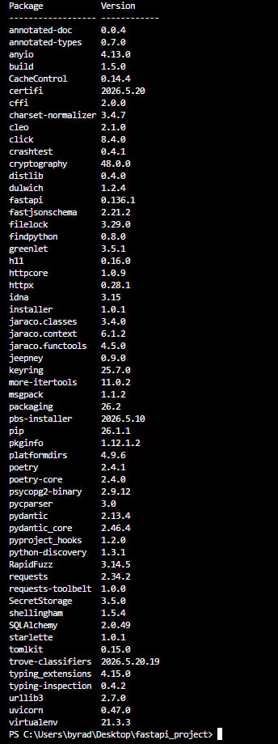

# Лабораторна робота №3: Структура проєкту, Pydantic та CRUD

Проєкт FastAPI, розгорнутий у Docker-контейнерах з базою даних PostgreSQL.

### 1. Успішний запуск контейнерів у Docker (`docker-compose ps`):
